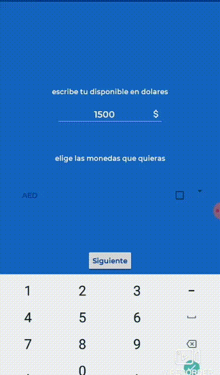
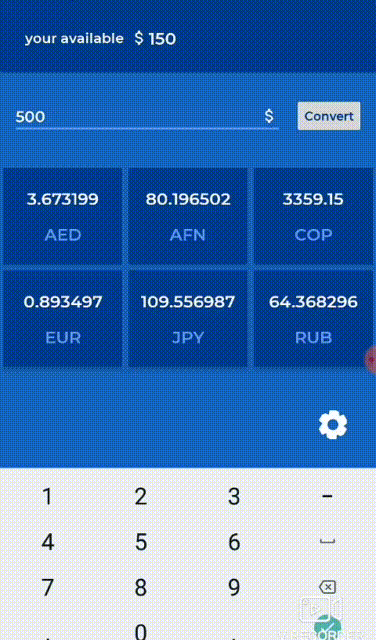

# Cash & Currency
tu mejor compañera de viaje

Objetivo:
el objetivo de cash & currency es acompañarte y resolver tus problemas de conversion de moneda al instante

solo en 3 simples pasos
1. abre y configura la aplicacion. 
    escribe cuanto disponible tienes para tu viaje
    

2. elige las monedas de los paises que vas a visitar

3. escribe el valor en dolares de lo que quieres convertir y ualá!

esta aplicación esta hecha con :

inyeccion de dependencias Dagger2

patron de arquitectura MVC cuenta con viewModels para el control de data. 

es proyectable a MVVM y Room

Retrofit

Kotlin

[]
License

Copyright (C) 2017 Uber Technologies

Licensed under the Apache License, Version 2.0 (the "License");
you may not use this file except in compliance with the License.
You may obtain a copy of the License at

http://www.apache.org/licenses/LICENSE-2.0

Unless required by applicable law or agreed to in writing, software
distributed under the License is distributed on an "AS IS" BASIS,
WITHOUT WARRANTIES OR CONDITIONS OF ANY KIND, either express or implied.
See the License for the specific language governing permissions and
limitations under the License.
